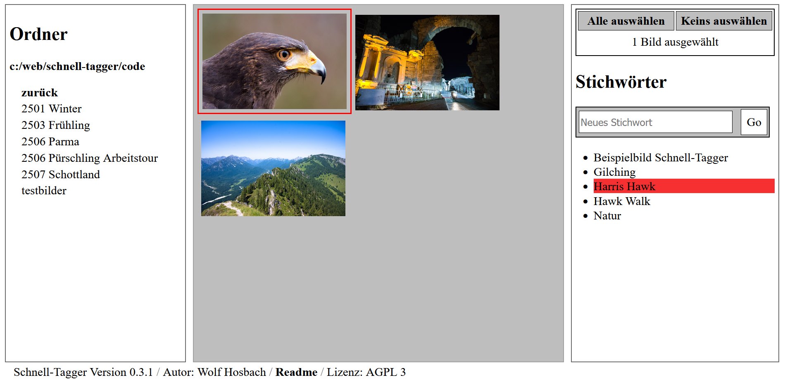

# Schnell-Tagger

Vielleicht etwas altmodisch, aber die Webanwendung dient dazu, Stichwörter bzw. Tags in JPEG-Bildern schnell und einfach zu verwalten: lesen und schreiben (löschen soll folgen). Sie modifiziert dafür die IPTC-Header der Bilder (nicht aber die Exif. oder XMP-Header). Zum Betrieb sind ein Webserver und PHP erforderlich. Ich habe mit XAMPP 8.2.12 unter Win 11 gearbeitet. 

## Wichtige Infos vorweg

* Die Anwendung ist **nicht für den Einsatz im öffentlichen Netz gedacht**
    1. Es gibt **keine ausreichenden Sicherheitsprüfungen** in den PHP-Skripten
    2. Die Anwendung lädt alle **Bilder komplett und unkomprimiert**, was für den Betrieb über das Internet ungeeignet ist.
* Wenn der Schreibprozess gestört wird, können Bilder kaputt gehen. **Es empfiehlt sich, die Funktion für Sicherheitskopien zu verwenden** (was auch die Voreinstellung ist). Sie kopiert die Bilder vor dem Schreiben des Headers.
* Im Folgenden spreche ich von der JavaScript-Datei *script.js*. Wer TypeScript einsetzt, ändert die Konfiguration in *script.ts* und kompiliert diese. 

## Spezifizierung

* Läuft in allen modernen Browsern
* Entwickelt mit XAMPP 8.2.12 für Windows
* Kompiliert mit `tsc -target es2021`
* Zum Lesen der IPTC-Tags dient der PHP-Befehl `$sizgetimagesize()`
* Zum Schreiben `iptcembed()`

## Basis-Funktionen

* Im linken Fenster blättert man durch die Verzeichnisse, wobei in mittleren Fenster die jeweiligen JPEG-Bilder des aktuellen Verzeichnisses erscheinen
* Bilder lassen sich markieren – auch mehrere – dann erscheinen im rechten Fenster alle Stichwörter der jeweilig markierten Bilder
* Den markierten Bildern lässt sich im rechten Fenster nun ein Stichwort zufügen

## Sicherheitskopien

Standardmäßig ist eine Funktion für Sicherheitskopien aktiv, da Bilder beim Schreiben kaputt gehen können, wenn das Skript beim Schreibvorgang gestört wird, (fremder Zugriff auf die Datei, Serverabsturz o.ä.). Die Kopien landen in einem Unterordner *schnell-tagger_sec...*. Erst dann beginnt der Schreibvorgang.

Diese Funktion lässt sich in der Datei *script.js* deaktivieren: 
* `const sicherheitskopien: boolean = true;` //eingeschaltet (Voreinstellung)
* `const sicherheitskopien: boolean = false;` //ausgeschaltet

## Installieren

* Für den Betrieb sind ein Webserver und PHP erforderlich
* Ein Webserver darf sicherheitstechnisch prinzipiell nur auf die Dateien innerhalb von *Document Root* zugreifen, deswegen müssen die zu bearbeitenden Bilder auch in diesem oder einem Unterverzeichnis liegen. 
* Document Root und die Konstante *startverzeichnis* im Skript *script.js* müssen übereinstimmen. Bei Apache findet sich die Konfiguration von *Document Root* in der Datei *httpd.conf*. Im Detail: 
    * Im JavaScirpt: `const startverzeichnis: string = 'C:/schnell-tagger/code';`
    * In der Webserver-Konfiguration:
        * `DocumentRoot "C:/schnell-tagger/code"`
        * `<Directory "C:/schnell-tagger/code">`
* Wer die Datei *index.html* anders benennt, beispielsweise als Teil einer größeren Anwendung, muss den zugehörigen Eintrag in *script.js* ändern, wegen der Funktion des Back-Buttons des Browsers. Hier fehlt noch eine automatische Erkennung.
    * `const dateiHistory: string = "./index_xyz.html";`

## Was fehlt noch?
* Bereits in den Skripten ist angelegt, dass Anwender einen Urheber in die Metadaten der Bilder eintragen können. Das funktioniert noch nicht
* Die Konfiguration sollte über eine ini-Datei erfolgen
* Stichwörter löschen fehlt schmerzlich
* Ein Test unter Linux fehlt
* Eine englische Version wäre wünschenswert
* Und eine mobile Fassung ebenso
Der Autor plant, diese Punkte abzuarbeiten
